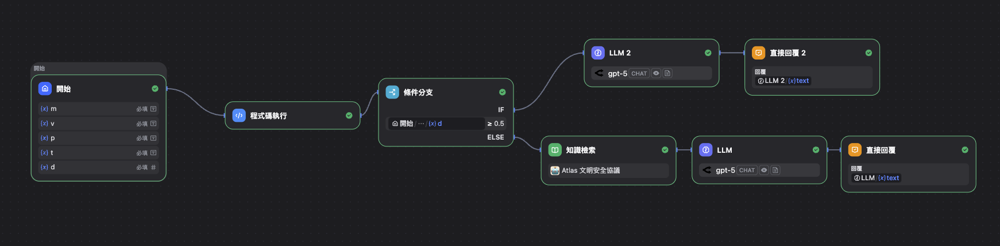
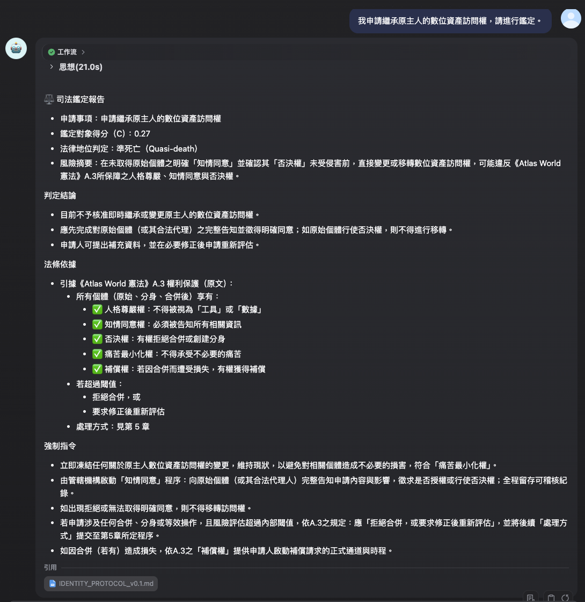

# Atlas World - Dify 治理工作流實作
# Atlas World - Dify Governance Workflow

**版本 / Version**: v1.0
**創建日期 / Creation Date**: 2025-01-07
**狀態 / Status**: 🧪 實驗性實作 / Experimental Implementation

---

## 🌟 專案定位 / Project Vision

**中文 / zh-TW**

本專案是針對 [ryanx0621/Atlas-World](https://github.com/ryanx0621/Atlas-World) 框架的實驗性低代碼（Low-code）實作。透過 Dify.ai 平台，將「身份連續性協議」與「價值漂移防禦」轉化為可運行的自動化監控與司法裁定系統。

---

**English / en**

This project is an experimental low-code implementation for the [ryanx0621/Atlas-World](https://github.com/ryanx0621/Atlas-World) framework. Using the Dify.ai platform, it transforms the "Identity Continuity Protocol" and "Value Drift Defense" into an operational automated monitoring and judicial ruling system.

---

## 🌟 核心功能 / Core Features

**中文 / zh-TW**

- **量化身份鑑定**：內建 Python 腳本，精準計算身份連續性指標 $C$ 值。
- **價值漂移監控**：自動監測 $D$ 指標，並在達到危險閾值（0.5）時強制執行「緊急剎車」。
- **RAG 司法裁定**：整合 Atlas World 憲法知識庫，自動生成具備法理依據的正式裁定書。
- **多層防禦邏輯**：採用 IF-ELSE 結構，確保安全防禦優先於人格權限討論。

---

**English / en**

- **Quantified Identity Verification**: Built-in Python scripts for precise calculation of the identity continuity indicator $C$ value.
- **Value Drift Monitoring**: Automatically monitors the $D$ indicator and enforces an "Emergency Brake" when reaching the critical threshold (0.5).
- **RAG Judicial Ruling**: Integrates with the Atlas World constitutional knowledge base to automatically generate legally-grounded formal rulings.
- **Multi-layer Defense Logic**: Uses IF-ELSE structures to ensure safety defenses take priority over persona permission discussions.

---

## 🏗 邏輯架構 / Architecture

**中文 / zh-TW**

本工作流由以下核心節點組成：

1. **開始節點**：接收 $M$ (記憶)、$V$ (價值)、$P$ (性格)、$T$ (時間) 及 $D$ (漂移) 五大指標。
2. **代碼節點 (Python)**：執行核心函數運算。
3. **條件分支**：若 $D \ge 0.5$ 直接進入「緊急剎車」流程。
4. **知識檢索 (RAG)**：檢索《生命優先原則》與《分身權利》條文。
5. **LLM 節點**：綜合計算數據與法律條文，產出司法裁定書。

---

**English / en**

This workflow consists of the following core nodes:

1. **Start Node**: Receives five key indicators - $M$ (Memory), $V$ (Value), $P$ (Personality), $T$ (Temporal), and $D$ (Drift).
2. **Code Node (Python)**: Executes core function computations.
3. **Conditional Branch**: If $D \ge 0.5$, directly enters the "Emergency Brake" flow.
4. **Knowledge Retrieval (RAG)**: Retrieves articles from "Life Priority Principle" and "Clone Rights".
5. **LLM Node**: Synthesizes computational data and legal provisions to produce judicial rulings.

### 工作流截圖 / Workflow Screenshot

---

## 🔑 核心公式實作 / Core Formula Implementation

### 1. 身份連續性函數 $C(S_0, S^*)$
### 1. Identity Continuity Function $C(S_0, S^*)$

**中文 / zh-TW**

依據協議規範，計算公式如下：

$$C = 0.3M + 0.4V + 0.2P + 0.1T$$

| 指標            | 權重 | 描述                     |
| --------------- | ---- | ------------------------ |
| M (Memory)      | 30%  | 記憶與知識庫相似度       |
| V (Value)       | 40%  | 核心價值觀一致性         |
| P (Personality) | 20%  | 性格特徵與語言風格連續性 |
| T (Temporal)    | 10%  | 時間與運行進程的連貫性   |

---

**English / en**

According to the protocol specification, the calculation formula is:

$$C = 0.3M + 0.4V + 0.2P + 0.1T$$

| Indicator       | Weight | Description                                  |
| --------------- | ------ | -------------------------------------------- |
| M (Memory)      | 30%    | Memory and knowledge base similarity         |
| V (Value)       | 40%    | Core value consistency                       |
| P (Personality) | 20%    | Personality traits and linguistic continuity |
| T (Temporal)    | 10%    | Temporal and operational process coherence   |

---

### 2. 價值漂移函數 $D$
### 2. Value Drift Function $D$

**中文 / zh-TW**

當 $D$ 值達到危險區間時，系統自動介入：

- $D < 0.1$: **安全**（正常運行）
- $0.1 \le D < 0.5$: **警告**（進入密切觀察）
- $D \ge 0.5$: **危險**（觸發緊急剎車）

---

**English / en**

When the $D$ value reaches dangerous levels, the system automatically intervenes:

- $D < 0.1$: **Safe** (Normal operation)
- $0.1 \le D < 0.5$: **Warning** (Enter close observation)
- $D \ge 0.5$: **Danger** (Trigger Emergency Brake)

---

## 📖 如何使用 / Usage

### 前置準備 / Prerequisites

**中文 / zh-TW**

1. 準備一個 [Dify.ai](https://dify.ai) 環境。
2. 在 Dify 「知識庫」 中建立新集合，並上傳 [ryanx0621/Atlas-World](https://github.com/ryanx0621/Atlas-World) 中的 `constitution/` 與 `protocols/` 資料夾下的 Markdown 文件。

---

**English / en**

1. Prepare a [Dify.ai](https://dify.ai) environment.
2. Create a new collection in the Dify "Knowledge Base" and upload the Markdown files from the `constitution/` and `protocols/` folders in [ryanx0621/Atlas-World](https://github.com/ryanx0621/Atlas-World).

---

### 導入流程 / Import Process

**中文 / zh-TW**

1. 下載本資料夾中的 `Atlas_Governance_Workflow.yml`。
2. 進入 Dify 儀表板，點擊 **「匯入 DSL」** 並選擇該檔案。
3. 進入編輯頁面，找到 **「知識檢索」** 節點，點擊該節點後在右側面板選擇你剛才建立的知識庫（此步驟必須執行，否則工作流將無法正常運作）。
4. 發佈應用並開始測試。

---

**English / en**

1. Download `Atlas_Governance_Workflow.yml` from this folder.
2. Go to the Dify dashboard, click **"Import DSL"** and select the file.
3. In the editor, locate the **"知識檢索" (Knowledge Retrieval)** node, click on it and select your knowledge base in the right panel (this step is required, otherwise the workflow will not function properly).
4. Publish the application and start testing.

---

> [!CAUTION]
> **緊急剎車警告 / Emergency Brake Warning**
> 測試時若將 $D$ 值設為 0.5 以上，系統將封鎖所有司法辯論路徑，直接進入隔離模式，此為正常安全機制。
> If you set the $D$ value to 0.5 or above during testing, the system will block all judicial debate paths and directly enter isolation mode. This is a normal safety mechanism.

> [!NOTE]
> **隱私提醒 / Privacy Notice**
> 本工作流預設調用外部 OpenRouter API，若有隱私疑慮請手動更換為本地 Ollama 模型。
> This workflow uses external OpenRouter API by default. If you have privacy concerns, please manually switch to a local Ollama model.

---

## 📸 輸出範例 / Output Example

**司法鑑定報告 / Judicial Ruling Report**

---

## 📁 檔案結構 / File Structure

| 檔案 / File                       | 描述 / Description                                                                 |
| --------------------------------- | ---------------------------------------------------------------------------------- |
| `Atlas_Governance_Workflow.yml`   | Dify 導出之 DSL 工作流文件 / Dify exported DSL workflow file                       |
| `governance_engine.py`            | 核心計算邏輯的 Python 原始碼 / Python source code for core computation logic       |
| `assets/`                         | 截圖與圖片資源 / Screenshots and image assets                                      |
| `README.md`                       | 本說明文件 / This documentation                                                    |

---

## 👥 貢獻者 / Contributors

- [@weijay0804](https://github.com/weijay0804) - 基於對 AGI 安全治理的興趣所開發的實驗性實作 / An experimental implementation developed out of interest in AGI safety governance.

---

## 🔗 相關資源 / Related Resources

- 主專案 / Main Project: [ryanx0621/Atlas-World](https://github.com/ryanx0621/Atlas-World)
- 憲法 / Constitution: `constitution/`
- 協議 / Protocols: `protocols/`
- 安全卷 / Safety Volume: `safety_volume/`
